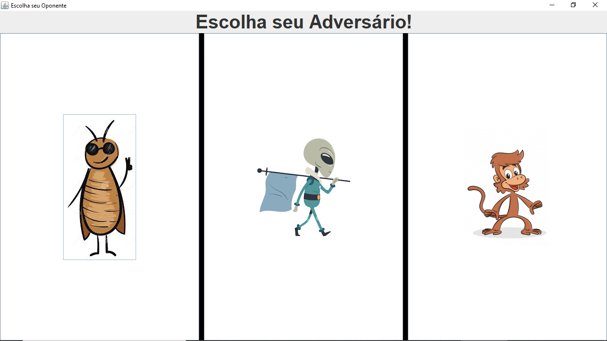

<h1>Jogo da Velha</h1>

## Jogo da velha feito em java no VS CODE 

  
  
Após a escolha do adversário inicia-se a partida, o jogo é jogado contra o computador.

  

Faltou implementar uma maneira de reiniciar o jogo através de um button.

### Folder Structure

<ul>
  <li>src
    <ul>Buttons
      <ul>_Button</ul>
      <ul>_ButtonAllien</ul>
      <ul>_ButtonCuca</ul>
      <ul>_ButtonMonkey</ul>
    </ul>
    <ul>computador
      <ul>_Computador</ul>
      <ul>_Computador_A</ul>
      <ul>_Computador_B</ul>
      <ul>_Computador_C</ul>
    </ul>
    <ul>imgs</ul>
     <ul>main
      <ul>_App</ul>
      <ul>_EscolheAdversario</ul>
      <ul>_Jogador</ul>
      <ul>_Tabuleiro</ul>
      <ul>_TesteVitoria</ul>
    </ul>
  </li>
</ul>

## Dependency Management

The `JAVA DEPENDENCIES` view allows you to manage your dependencies. More details can be found [here](https://github.com/microsoft/vscode-java-pack/blob/master/release-notes/v0.9.0.md#work-with-jar-files-directly).
